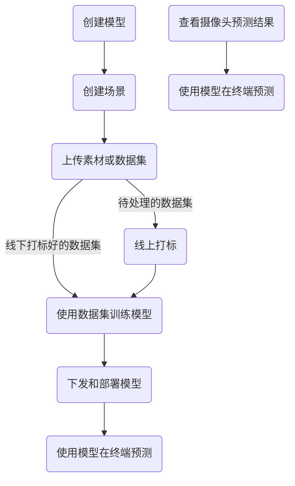

# 望知AI平台

望知AI平台是一个目标检测和目标跟踪的AI平台，  
支持目标检测和目标跟踪，支持多种目标检测模型，  
用户可以根据自身需求自行训练和部署目标检测模型。

任务->场景->
创建模型->创建场景->上传数据集
（图片集即包含多张图片的压缩包，视频，或者voc等素材）
训练->部署->预测  
可以改成上传图片素材，上传视频素材，上传VOC打标后的素材三个按钮，然后选择场景，选择模型，然后点击开始训练，然后点击开始部署，然后点击开始预测。

## 数据集管理

图片集即包含多张图片的压缩包，视频，或者voc等素材

***1.上传图片/视频素材线上手动打标***

如果是视频就抽帧成图片集，  
然后一张一张进行打标

***2.上传线下打标好的数据集***

线下使用打标工具打标好的数据集上传  
例如：上传VOC打标后的素材

## 模型下发和自动部署

## 查看摄像头预测结果

### 资产管理

训练模型使用的服务器  

模型推理使用的服务器

### 1. 网站概念

目标：
用户可以上传图片。  
用户可以给图片添加标签（分类、描述等）。  
用户可以浏览已标记的图片及其标签。  
管理员可以管理用户、图片和标签。  

功能模块：  
用户管理：注册、登录、个人资料管理。  
图片上传：上传图片并预览。  
标签管理：添加、编辑和删除标签。  
图片展示：查看图片列表，搜索功能，按照标签筛选。  
权限控制：管理员和普通用户的访问权限不同。  

### 2. 技术栈  

前端：
HTML/CSS/JavaScript：页面布局和样式。  
React：选择一个前端框架构建交互式界面。  
Axios：与后端通信。  
后端：  
REST API：提供数据接口给前端调用。  
数据库：  
PostgreSQL：关系型数据库存储用户信息、图片元数据和标签。  
如果需要非结构化的数据存储，比如图片的额外属性。  
图片存储：  
本地文件系统：如果不需要大规模部署，可以考虑本地存储。

### 3. 开发步骤

需求分析：确定具体的功能需求和用户体验设计。  
设计数据库模型：定义用户、图片、标签等实体的关系。  
后端开发：实现RESTful API，处理HTTP请求和响应。  
前端开发：使用前端框架构建用户界面，调用后端API。  
测试：单元测试、集成测试和用户接受度测试。  
部署：将应用部署到服务器或云平台。  
维护和更新：根据用户反馈和业务发展持续优化。

### 4. 安全性和性能考虑

身份验证和授权：确保只有认证的用户才能上传图片和添加标签。  
数据加密：敏感信息如密码应该加密存储。  
负载均衡和缓存：对于高流量的网站，考虑使用负载均衡和内容缓存来提高性能。

### 5. 实现细节

具体的实现会涉及到很多细节，包括但不限于：  
使用OAuth或其他身份验证协议确保用户安全。  
图片上传时的尺寸限制、格式检查和病毒扫描。  
服务器端的错误处理和日志记录。  
使用CDN加速图片加载速度。
